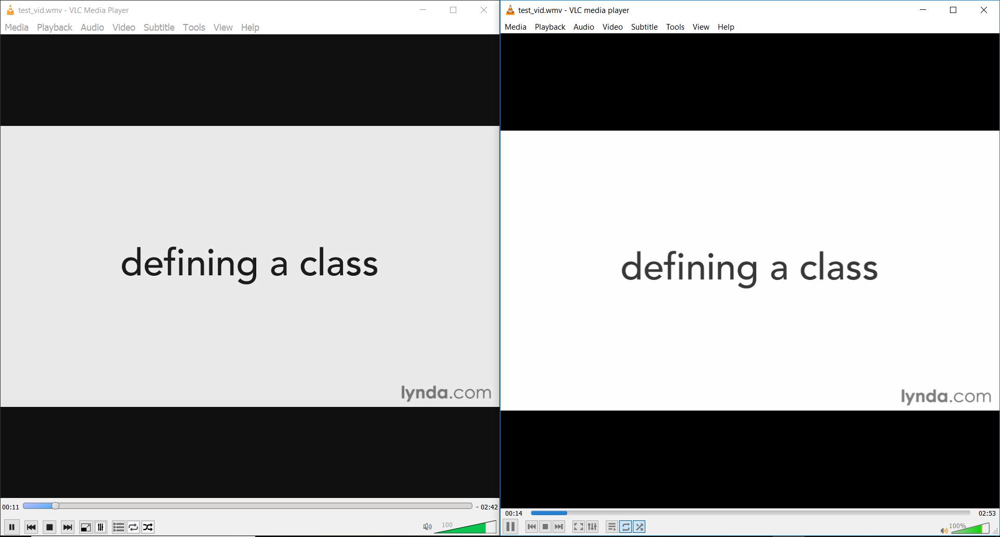

# vlc-clone
This is a mini video player that mimics the VLC media player.

## Motivation
 
 The goal of this project is to present a single  application that makes extensive use of most of the QT modules. The project is solely for academic or learning purposes. The UI has been created to replicate almost exactly that of the VLC media player and same goes for the functionality. However some of the functionality has not been implemented and I have no intentions of doing that anytime soon (it's not interesting at all building something that already exists, except its for the purpose of learning). I will be moving my efforts towards contributing to the actual VLC media player.

## Demo

Left vlc_clone and Rigth actual vlc media player. (I hope you can tell the difference :) Enjoy! )

## Built with

- QT 5

## Contributing
   There are still a number of uncompleted features, if you think you will learn something by implementing them, then go ahead and create a pull request.
   
## Credits

- Videolan VLC media player

  https://github.com/videolan/vlc.git
  
  http://www.videolan.org/vlc/
  
 ## License
----

 LGPL-3.0
 &copy; Kumbong Hermann
